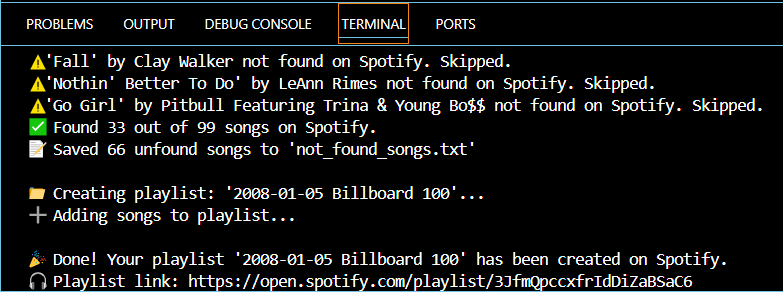

# 🎧 Billboard to Spotify Playlist Maker

**Type:** Intermediate Python Automation Project  
**Built With:** `Python`, `Spotipy`, `BeautifulSoup`, `Requests`, `dotenv`

---

## 🔍 Overview

Turn any Billboard Hot 100 chart into a real Spotify playlist – just by entering a date.  
Whether it's your birthday, a nostalgic throwback, or a special day in history, this tool brings the music of that moment directly into your Spotify account.

---

## 🧠 What This Project Demonstrates

This isn’t just a simple API project — it showcases real-world software engineering skills:

- ✅ **API Integration**: Authenticated with the Spotify Web API using OAuth2, and retrieved chart data via web scraping.
- 🎯 **Error Handling**: Handles edge cases like invalid dates, mid-week entries, and partial Billboard charts.
- 🧠 **Data Cleaning & Matching**: Matched song titles and artists accurately using structured search queries.
- 📅 **Date Normalization**: Auto-corrects to Billboard's Saturday-only chart policy using dynamic logic.
- 🧪 **Scraping Resilience**: Adapts to both old and modern Billboard website layouts.
- 💾 **Modular Codebase**: Organized with `main.py`, `scraper.py`, and `spotify_client.py` to follow clean separation of concerns.
- 📁 **Logging**: Saves unfound songs to a `.txt` file for transparency.

---

## 🚀 Features

- 🎧 Create Spotify playlists from any Billboard Hot 100 chart
- 📅 Accepts any date from 1958 onward
- 🔁 Automatically corrects non-Saturday dates
- 📉 Falls back to closest valid chart if data is incomplete
- 🔗 Playlist link printed after creation
- 📝 Logs any songs not found on Spotify

---

## 📦 Project Structure

```
spotify_playlist_maker/
├── main.py               # Orchestrates user input, scraping, Spotify integration
├── scraper.py            # Scrapes Billboard chart titles & artists
├── spotify_client.py     # Handles Spotify login, search, and playlist creation
├── not_found_songs.txt   # Auto-generated file logging skipped songs
├── .env                  # Contains your Spotify API credentials
├── .env.example          # Example template for environment setup
├── requirements.txt      # Project dependencies
├── README.md             # You're reading it!
└── media/
    ├── screenshots/
    │   └── terminal_output.png
    └── demo/
        └── demo.gif
```

---

## ⚙️ Installation

### 1. Clone the repo

```bash
git clone https://github.com/YOUR_USERNAME/spotify_playlist_maker.git
cd spotify_playlist_maker
```

### 2. Set up environment variables

Copy the example file and fill in your credentials:

```bash
cp .env.example .env
```

Inside `.env`:

```
SPOTIPY_CLIENT_ID=your_spotify_client_id
SPOTIPY_CLIENT_SECRET=your_spotify_client_secret
SPOTIPY_REDIRECT_URI=http://127.0.0.1:8888/callback
```

> 🔐 You can get these credentials by creating an app on the [Spotify Developer Dashboard](https://developer.spotify.com/dashboard).

### 3. Install dependencies

```bash
pip install -r requirements.txt
```

---

## 💻 Usage

```bash
python main.py
```

- Input a date (format: `YYYY-MM-DD`)
- App auto-corrects to nearest Saturday if needed
- Fallback logic engages if Billboard data is missing
- Playlist created in your Spotify account with a clickable link

---

## 📄 Environment Variables

| Variable               | Description                              |
|------------------------|------------------------------------------|
| `SPOTIPY_CLIENT_ID`     | Your Spotify app's client ID             |
| `SPOTIPY_CLIENT_SECRET` | Your Spotify app's client secret         |
| `SPOTIPY_REDIRECT_URI`  | Must match the URI set in your Spotify app (e.g. `http://localhost:8888/callback`) |

---

## 🖼️ Screenshots & Demo

### ▶️ GIF Demo


### 🖥 Terminal Output


---

## 🧪 Example Output

```bash
📅 Enter a Billboard chart date (YYYY-MM-DD): 1999-09-30
⚠️ Billboard only publishes charts for Saturdays.
✅ Using previous Saturday instead: 1999-09-25
🔍 Scraping Billboard Hot 100 for 1999-09-25...
🎧 Playlist created: https://open.spotify.com/playlist/...
```

---

## 💡 Future Ideas

- GUI version using `tkinter`
- Deployable Flask web app version
- Add CLI argument support (`--date`) for automation
- Export full chart to `.csv` or `.json`
- Improve search accuracy by checking artist aliases

---

## 👩‍💻 Built By

This project was built as part of a learning journey through real-world Python development, using APIs, scraping, and data cleanup — a great showcase of engineering thinking and problem-solving.
